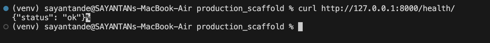
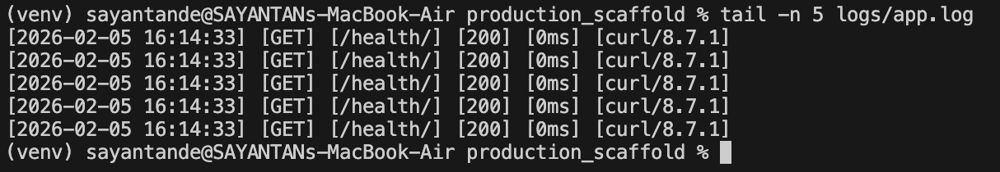
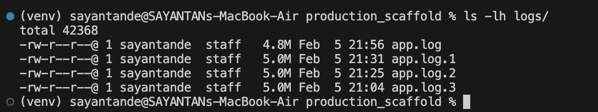
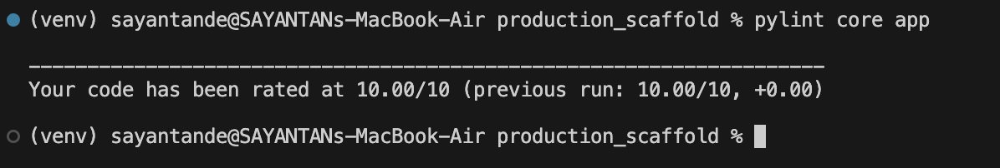

# Production Scaffolding & Logging System

## Overview

This project is a **production-ready Django backend scaffold** designed to demonstrate professional backend engineering practices.
It mirrors how real-world backend services are structured, configured, logged, validated, and reviewed.

Key objectives of this project:

* Clean project initialization
* Environment-based configuration using `.env`
* Health monitoring endpoint
* Request-level structured logging
* Log rotation with size limits and retention
* Enforced code quality standards (black, isort, pylint)

All implementation details strictly follow the assignment requirements and common industry practices.

---

## Project Structure

```text
production_scaffold/
├── app/                    # Django project settings
│   ├── settings.py
│   ├── urls.py
│   ├── asgi.py
│   └── wsgi.py
├── core/                   # Application logic
│   ├── middleware.py       # Request logging middleware
│   ├── views.py            # Health endpoint
│   ├── urls.py
│   └── apps.py
├── logs/                   # Rotating log files (generated at runtime)
│   └── app.log
├── manage.py
├── requirements.txt
├── .env.example
├── .gitignore
└── README.md
```

---

## Environment Setup

This section explains how to set up the project from scratch on a fresh machine.
Following these steps allows any evaluator or engineer to reproduce the environment reliably.

### 1. Create and activate virtual environment

```bash
python3 -m venv venv
source venv/bin/activate
```

**Screenshot required:**
Virtual environment activated in terminal.

---

### 2. Install dependencies

```bash
pip install -r requirements.txt
```

**Screenshot required:**
Successful installation of dependencies without errors.

---

### 3. Configure environment variables

#### Create required directories

The logging system writes to a physical file.
You must create the `logs/` directory manually before running the server.

```bash
mkdir -p logs
```

This directory will store:

* `app.log` (active log file)
* `app.log.1` to `app.log.5` (rotated archives)

If this directory does not exist, the application will fail to write logs.

**Screenshot required:**
`ls` output showing the `logs/` directory created.

---

#### Create `.env` file

Create a `.env` file using the provided example:

```bash
cp .env.example .env
```

Edit `.env` as needed:

```env
DEBUG=True
SECRET_KEY=your-secret-key
LOG_FILE_PATH=logs/app.log
```


---

## Running the Server

After completing the environment setup, start the Django development server:

```bash
python manage.py runserver
```

Server will start at:

```text
http://127.0.0.1:8000/
```


---

## Health Check Endpoint

The health endpoint is a lightweight service probe.
In production systems, this endpoint is used by:

* Load balancers
* Monitoring systems

Its purpose is to verify that the application process is alive and able to respond to HTTP requests.

### Endpoint

```http
GET /health/
```

### Response

```json
{
  "status": "ok"
}
```

### Test via curl

```bash
curl http://127.0.0.1:8000/health/
```

**Screenshot required:**
Browser or curl output showing `{"status": "ok"}`.



---

## Middleware & Request Logging

A custom Django middleware intercepts **every incoming HTTP request** and logs structured request-level data.

### What is captured per request

* HTTP method (GET, POST, etc.)
* Request path
* HTTP status code
* Total execution time (milliseconds)
* Client user-agent

Execution time is measured by recording timestamps before and after request processing.
This mirrors how production observability systems work.

Logging is transparent and applies to all endpoints automatically.

---

## Log Format (Strictly Enforced)

Every request is logged in the following exact format:

```text
[TIMESTAMP] [METHOD] [PATH] [STATUS_CODE] [EXECUTION_TIME_MS] [USER_AGENT]
```

### Example

```text
[2026-02-05 15:12:22] [GET] [/health/] [200] [0ms] [curl/8.7.1]
```

**Screenshot required:**
`tail -n 5 logs/app.log` showing multiple structured request logs.



---

## Log Rotation (Critical Requirement)

Log rotation is a critical production requirement.
Without rotation, log files grow indefinitely and can exhaust disk space.

This project implements **size-based log rotation** using Python’s `RotatingFileHandler`.

### Configuration

```python
maxBytes = 5 * 1024 * 1024  # 5 MB
backupCount = 5
```

* Maximum log file size: **5 MB**
* Retains last **5 rotated files**

---

### How Rotation Works

When `app.log` exceeds 5 MB:

```text
app.log     → app.log.1
app.log.1   → app.log.2
...
app.log.5   → deleted
```

A new `app.log` file is created automatically.

---

### How Log Rotation Was Verified

High-volume requests were generated:

```bash
for i in {1..150000}; do
  curl http://127.0.0.1:8000/health/ > /dev/null
done
```

Then verified using:

```bash
ls -lh logs/
du -h logs/*
```

* Rotated files (`app.log.1`, `app.log.2`, etc.) reach ~5 MB
* Active `app.log` may be smaller until the next rotation
* Byte-level verification done using `ls -l`

**Screenshots required:**

* Directory listing showing `app.log`, `app.log.1` … `app.log.5`
* File sizes around ~5 MB



---

## Code Quality & Engineering Standards

This project enforces professional Python engineering standards using automated tooling commonly required in real-world backend teams and CI pipelines.

### Tools Used

* **black** — code formatter
* **isort** — import ordering
* **pylint** — static analysis

All tools are included in `requirements.txt`.

---

### black — Code Formatting

```bash
black .
```

* Enforces consistent formatting
* Deterministic output
* Re-running produces no changes once compliant

**Screenshot required:**
Output showing `All done!` and no files changed.


---

### isort — Import Ordering

```bash
isort .
```

* Sorts and groups imports automatically
* Ensures PEP8-compliant import structure

**Screenshot required:**
Output showing imports fixed or skipped.


---

### pylint — Static Analysis

```bash
pylint core app
```

* Detects unused imports, arguments, and design issues
* Django-specific warnings are reviewed and handled intentionally

**Final score achieved:** `9.8+/10`

**Screenshot required:**
Terminal output showing pylint score ≥ 9.5.



---

## .gitignore

Sensitive and generated files are excluded:

```text
.env
venv/
logs/
__pycache__/
```

---


## Methodology & Engineering Approach

This project was built using a **production-first mindset**, prioritizing correctness, observability, and maintainability.

### Design Principles

* Separation of concerns
  Middleware handles logging, views handle responses, settings handle configuration
* Environment-driven configuration
  No secrets or paths are hardcoded
* Fail-safe logging
  Logs written to both console and rotating file
* Framework-aligned design
  Django middleware and view contracts are respected

### Logging Methodology

* Centralized logging via Django logging configuration
* Single strict log format for machine readability
* Execution time captured at middleware level to avoid duplication

### Quality Assurance

* Automated formatting with black
* Standardized imports with isort
* Static analysis with pylint for long-term maintainability

This approach mirrors how production backend services are designed, validated, and reviewed in professional engineering teams.

---

## Notes

* Remaining pylint warnings are framework-specific and intentionally handled
* Middleware implementation follows Django’s official middleware contract
* Logging behavior mirrors real production services

---

## Author

**Sayantan De**

---

# production_scaffold
